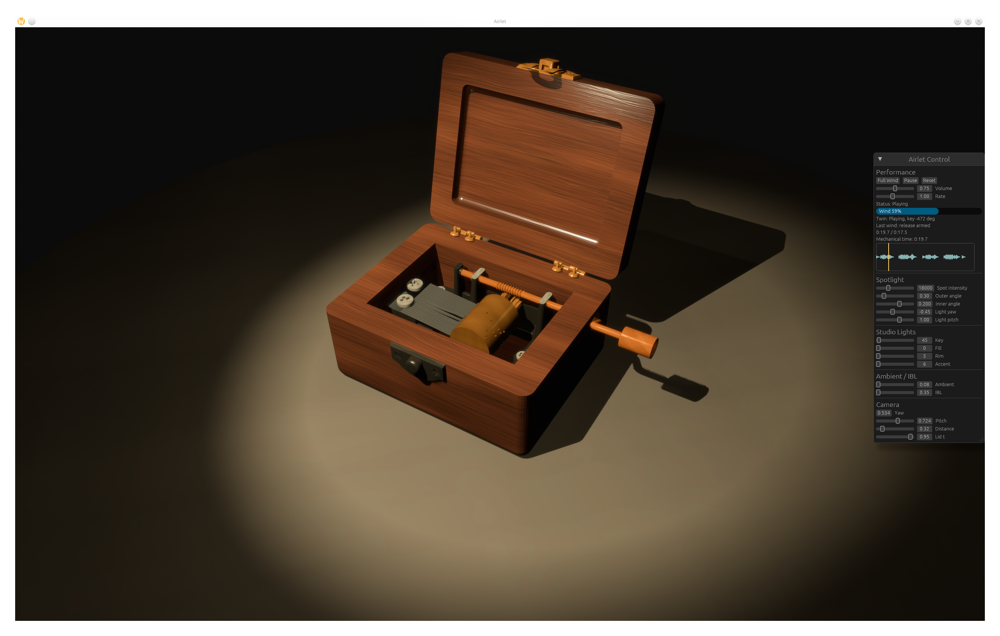

# Airlet

Airlet is a Bevy-based 3D music-box performance app. The app renders a
mechanical music box, drives its cylinder/comb/key animation from a mechanical
twin state, and plays the generated Air theme through the Rust audio pipeline.

## Preview

> Screenshot slot: add a current app screenshot at
> `docs/imgs/airlet-preview.png`.



## Current Focus

- Digital-twin winding and playback state.
- Procedural cylinder, tooth, and comb visualization.
- Mesh-picking interaction for winding key and lid.
- Dark high-contrast exhibit lighting.
- Procedural wood/metal material generation and material-baked GLB output.

## Setup

Install the Rust toolchain and `uv`. The Python project under `py/` owns the
asset-generation tools.

After cloning, regenerate runtime assets:

```bash
uv run --project py airlet-bake-materials \
  --manual-rounded-source assets/generated/music_box_manual_rounded_shell.glb
```

This recreates ignored generated files:

- `assets/generated/music_box_aligned_base.*`
- `assets/generated/music_box_material_baked.*`
- `assets/textures/procedural/*.png`

The tracked source assets and generation details are documented in
`docs/asset-generation.md`.

## Run

```bash
cargo run
```

Useful environment flags:

```bash
AIRLET_DEBUG=1 cargo run
AIRLET_SCREENSHOT=target/airlet.png cargo run
```

`AIRLET_DEBUG=1` enables the local debug action endpoint. `AIRLET_SCREENSHOT`
captures the primary window and exits.

## Validate

```bash
uv run --project py python -m compileall py/airlet_audio_lab
cargo fmt --all
cargo check --workspace
cargo test --workspace
git diff --check
```

## Repository Shape

- `src/` - Bevy app, scene, lighting, model view, twin state, controls, and
  interaction systems.
- `crates/airlet/` - Bevy-free score, timeline, synthesis, presets, and
  mechanism planning logic.
- `crates/airlet-model/` - Model spec parsing and movable model pose helpers.
- `py/airlet_audio_lab/` - Python tools for audio/model/material experiments
  and repeatable asset generation.
- `docs/` - Roadmap, architecture notes, lighting research, MCP/debug docs, and
  asset generation notes.
